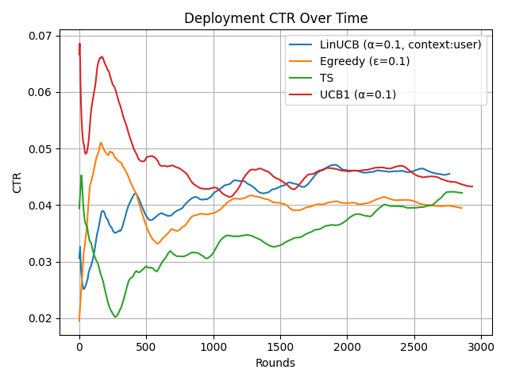

# News Recommendation System using Reinforcement Learning

This project implements a personalized news recommendation system using the using multi-armed bandit algorithms. It evaluates and compares algorithms like Linear Upper Confidence Bound, Thompson Sampling, UCB1, and Epsilon-Greedy to model and predict user click behavior. By simulating user interactions, the system compares these algorithms in terms of Click-Through Rate (CTR) and decision efficiency, providing insights into their performance in real-world recommendation scenarios.

## Features

- 📊 **Multiple Algorithms Compared**:
  - `LinUCB` (contextual bandit with user/item features)
  - `Thompson Sampling`
  - `UCB1`
  - `Epsilon-Greedy`
- **User Feedback Loop**: Accepts user clicks on recommended articles and updates the model online.
- **CTR Tracking**: Calculates and displays click-through rate based on real user interactions.
- **Performance Visualization** via CTR-over-time plots.

## Dataset

- The project uses the MIND dataset, which contains millions of news impressions and user click behaviors.
- Due to size and licensing, the dataset is **not included** in the repository.
- Users should download the dataset from the official [MIND dataset site](https://msnews.github.io/) and place it in the designated folder before running the code.

## 📊 Sample Output

Below is a sample result comparing different Multi-Armed Bandit algorithms on the MIND dataset:

---

## 🚀 Future Work

- Incorporate time-aware or session-based user modeling for better personalization.
- Extend support for hybrid recommendation (content-based + collaborative).
- Integrate a real-time user interaction loop via web interface.
- Experiment with deeper neural contextual bandits (e.g., Deep LinUCB, DQN).
- Explore fairness and bias mitigation in article selection

---

## 📚 References

1. Lihong Li, Wei Chu, John Langford, Robert E. Schapire.  
   **A Contextual-Bandit Approach to Personalized News Article Recommendation.**  
   *Proceedings of the 19th International Conference on World Wide Web (WWW), 2010.*  
   https://arxiv.org/pdf/1003.0146.pdf

3. Lihong Li, Wei Chu, John Langford, Xuanhui Wang.  
   **Unbiased Offline Evaluation of Contextual-bandit-based News Article Recommendation Algorithms.**  
   *Proceedings of the 16th ACM SIGKDD International Conference on Knowledge Discovery and Data Mining (KDD), 2011.*  
    https://arxiv.org/pdf/1003.5956.pdf
